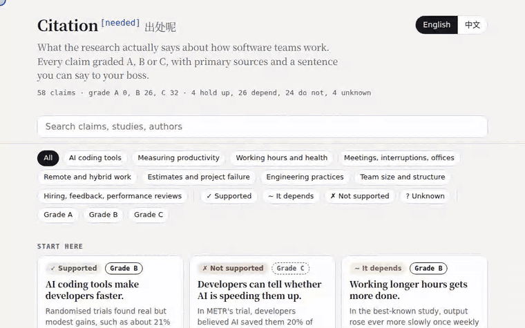

**English** · [简体中文](README.zh-CN.md)

 

**Every argument about how software teams work, with the receipts.**

Does overtime get more done? Do AI coding tools really make teams faster? Is remote work less productive? Why does output per person fall when a team doubles? This repo checks the research behind those arguments: **58 claims, each with a verdict, an A/B/C evidence grade, primary sources, and one sentence you can say to your boss.**

4 hold up, 26 depend on context, 24 do not hold up, 4 have no good evidence either way. Evidence grades: 0 A, 26 B, 32 C. None currently earns an A under this handbook's rubric. Study designs, populations and limitations are described per claim; no A grades does not mean there are no randomized trials.

> **How this was made:** drafted with AI assistance, every source looked up by CI, explicitly registered quote snippets matched for sources marked for abstract verification; other figures and inferences are not automatically checked. If we got something wrong, [challenge it](#challenge-a-claim). Details in [How sources are checked](#how-sources-are-checked).

## Start here

| Claim | What the evidence says | Verdict · Grade |
|---|---|---|
| [AI coding tools make developers faster.](chapters/01-ai.md#ai-faster) | Randomised trials found real but modest gains, such as about 21% less time at Google. Two trials found none. | ✓ Supported · B |
| [Developers can tell whether AI is speeding them up.](chapters/01-ai.md#ai-self-estimate) | In METR's trial, developers believed AI saved them 20% of their time. The clock said it cost them 19%. | ✗ Not supported · C |
| [Working longer hours gets more done.](chapters/03-hours.md#hours-more-output) | In the best-known study, output rose ever more slowly once weekly hours passed a threshold. | ~ It depends · B |
| [It takes 23 minutes to recover from every interruption.](chapters/04-meetings.md#meetings-23-minutes) | In one 24-person observation, same-day returns averaged 25 minutes 26 seconds. It did not measure time to refocus. | ✗ Not supported · B |
| [Open-plan offices increase collaboration.](chapters/04-meetings.md#meetings-open-plan-collaboration) | After two firms moved to open plan, face-to-face talk fell by about 70% and electronic messages rose. | ✗ Not supported · B |
| [Working from home lowers productivity.](chapters/05-remote.md#remote-wfh-productivity) | Two randomised trials found a gain or no loss. A pandemic-era study of IT staff found output per hour fell 8 to 19%. | ~ It depends · B |
| [70% of IT projects fail.](chapters/06-estimation.md#estimation-chaos-failure-rate) | The 70% counts any gap from the original estimate as failure, and two peer-reviewed critiques call the figures misleading. | ✗ Not supported · B |
| [10x programmers exist: some developers are ten times as productive as their peers.](chapters/07-practices.md#practices-10x-programmer) | The 28:1 gap behind the 10x idea comes from 1960s lab studies, and a later reanalysis called it incorrect and misleading. | ? Unknown · C |
| [Code review mainly finds bugs.](chapters/07-practices.md#practices-code-review-bugs) | At Microsoft, 14% of code review comments were about defects. Studies of other teams found about 75% of findings concern maintainability. | ✗ Not supported · B |
| [Adding people to a late project makes it later.](chapters/08-teams.md#teams-brooks-law) | Brooks called it an oversimplification. In the best-known simulation, late hires always raised cost but did not always delay delivery. | ~ It depends · C |
| [A gut-feel interview is a good way to hire.](chapters/09-people.md#people-gut-interview) | A 2022 meta-analysis puts structured interviews at .42 and unstructured ones at .19 for predicting job performance. | ✗ Not supported · B |

## Use it

- **Web reader**: search, filter, tick a few claims and print a one-page brief for your boss: https://mbappewu.github.io/citation-needed/
- **Offline**: single-file HTML and PDFs on the [Releases](https://github.com/MbappeWU/citation-needed/releases/latest)
- **Ask your AI assistant**: `npx skills add MbappeWU/citation-needed` (Claude Code, Codex, Cursor and others; answers come with the grade and the source)

## Contents

### [AI coding tools](chapters/01-ai.md)

Do they make teams faster, safer, better? What randomized trials and field data say.

| Claim | Verdict | Grade |
|---|---|---|
| [AI tools do not hurt code quality.](chapters/01-ai.md#ai-code-quality) | ✗ Not supported | C |
| [AI-generated code is as secure as human-written code.](chapters/01-ai.md#ai-code-security) | ✗ Not supported | C |
| [Adopting AI improves software delivery performance.](chapters/01-ai.md#ai-delivery) | ~ It depends | C |
| [AI tools make experienced developers faster.](chapters/01-ai.md#ai-experienced-faster) | ~ It depends | C |
| [AI coding tools make developers faster.](chapters/01-ai.md#ai-faster) | ✓ Supported | B |
| [AI helps junior developers more than seniors.](chapters/01-ai.md#ai-juniors-more) | ~ It depends | C |
| [Using AI does not hurt how well developers learn.](chapters/01-ai.md#ai-learning) | ✗ Not supported | B |
| [Those AI studies are out of date, because today's tools are much better.](chapters/01-ai.md#ai-old-studies) | ~ It depends | C |
| [Developers can tell whether AI is speeding them up.](chapters/01-ai.md#ai-self-estimate) | ✗ Not supported | C |

### [Measuring productivity](chapters/02-measure.md)

What counts, what misleads, and why per-head output falls as teams grow.

| Claim | Verdict | Grade |
|---|---|---|
| [Commits or pull requests per developer reveal who performs best.](chapters/02-measure.md#measure-commits-per-dev) | ✗ Not supported | C |
| [DORA's four key metrics predict how well a team performs.](chapters/02-measure.md#measure-dora-predict) | ~ It depends | C |
| [Lines of code are a fair measure of developer productivity.](chapters/02-measure.md#measure-lines-of-code) | ✗ Not supported | C |
| [The number of releases, features or tickets shipped measures a team's output.](chapters/02-measure.md#measure-releases-output) | ✗ Not supported | C |
| [Developer satisfaction is a leading indicator of productivity.](chapters/02-measure.md#measure-satisfaction-leading) | ~ It depends | C |
| [One metric can capture developer productivity.](chapters/02-measure.md#measure-single-metric) | ✗ Not supported | C |
| [Velocity in story points lets you compare teams.](chapters/02-measure.md#measure-velocity-compare) | ✗ Not supported | C |

### [Working hours and health](chapters/03-hours.md)

Overtime, output per hour, and the health bill.

| Claim | Verdict | Grade |
|---|---|---|
| [A four-day week means less gets done.](chapters/03-hours.md#hours-four-day-week) | ? Unknown | C |
| [Long hours are just a lifestyle choice with no real health cost.](chapters/03-hours.md#hours-health-cost) | ✗ Not supported | B |
| [Working longer hours gets more done.](chapters/03-hours.md#hours-more-output) | ~ It depends | B |

### [Meetings, interruptions, offices](chapters/04-meetings.md)

The folklore about focus time and open-plan offices, checked.

| Claim | Verdict | Grade |
|---|---|---|
| [It takes 23 minutes to recover from every interruption.](chapters/04-meetings.md#meetings-23-minutes) | ✗ Not supported | B |
| [Back-to-back meetings are harmless.](chapters/04-meetings.md#meetings-back-to-back) | ? Unknown | C |
| [Daily stand-ups improve team coordination.](chapters/04-meetings.md#meetings-daily-standups) | ~ It depends | C |
| [Developers need long uninterrupted blocks to be productive.](chapters/04-meetings.md#meetings-focus-blocks) | ~ It depends | C |
| [Meeting-free days raise productivity.](chapters/04-meetings.md#meetings-no-meeting-days) | ? Unknown | C |
| [Open-plan offices increase collaboration.](chapters/04-meetings.md#meetings-open-plan-collaboration) | ✗ Not supported | B |

### [Remote and hybrid work](chapters/05-remote.md)

Randomized experiments and field data, including a large Chinese company.

| Claim | Verdict | Grade |
|---|---|---|
| [Remote work damages collaboration.](chapters/05-remote.md#remote-collaboration) | ~ It depends | B |
| [Remote developers produce less.](chapters/05-remote.md#remote-developers-output) | ~ It depends | C |
| [Hybrid work hurts performance and promotion.](chapters/05-remote.md#remote-hybrid-performance) | ✗ Not supported | B |
| [Junior engineers cannot learn properly when working remotely.](chapters/05-remote.md#remote-juniors-learning) | ~ It depends | B |
| [Video calls are as good as meeting in person for creative work.](chapters/05-remote.md#remote-video-creativity) | ✗ Not supported | B |
| [Working from home lowers productivity.](chapters/05-remote.md#remote-wfh-productivity) | ~ It depends | B |

### [Estimates and project failure](chapters/06-estimation.md)

Why plans slip, and which failure statistics you should not repeat.

| Claim | Verdict | Grade |
|---|---|---|
| [Experienced estimators are not affected by anchoring.](chapters/06-estimation.md#estimation-anchoring-experts) | ✗ Not supported | B |
| [If we plan carefully enough, our software estimates will be accurate.](chapters/06-estimation.md#estimation-careful-planning) | ✗ Not supported | C |
| [70% of IT projects fail.](chapters/06-estimation.md#estimation-chaos-failure-rate) | ✗ Not supported | B |
| [Expert estimates are less accurate than formal estimation models.](chapters/06-estimation.md#estimation-experts-vs-models) | ✗ Not supported | C |
| [IT projects overrun by a predictable margin, so a fixed buffer is enough.](chapters/06-estimation.md#estimation-overrun-margin) | ✗ Not supported | C |
| [Tight deadlines make teams more productive.](chapters/06-estimation.md#estimation-tight-deadlines) | ~ It depends | B |

### [Engineering practices](chapters/07-practices.md)

Pair programming, TDD, code review, types, technical debt.

| Claim | Verdict | Grade |
|---|---|---|
| [10x programmers exist: some developers are ten times as productive as their peers.](chapters/07-practices.md#practices-10x-programmer) | ? Unknown | C |
| [Agile projects succeed more often than waterfall projects.](chapters/07-practices.md#practices-agile-succeeds) | ~ It depends | C |
| [Code review mainly finds bugs.](chapters/07-practices.md#practices-code-review-bugs) | ✗ Not supported | B |
| [Pair programming improves code quality.](chapters/07-practices.md#practices-pair-programming) | ~ It depends | B |
| [Shipping faster means more incidents.](chapters/07-practices.md#practices-speed-incidents) | ~ It depends | C |
| [Static typing prevents bugs.](chapters/07-practices.md#practices-static-typing-bugs) | ~ It depends | B |
| [Test-driven development reduces defects.](chapters/07-practices.md#practices-tdd-defects) | ~ It depends | B |
| [Technical debt slows teams down.](chapters/07-practices.md#practices-tech-debt-slows) | ✓ Supported | B |

### [Team size and structure](chapters/08-teams.md)

Brooks's law, Conway's law, psychological safety.

| Claim | Verdict | Grade |
|---|---|---|
| [The best team size is five to nine people.](chapters/08-teams.md#teams-best-size-five-to-nine) | ~ It depends | C |
| [Adding people to a late project makes it later.](chapters/08-teams.md#teams-brooks-law) | ~ It depends | C |
| [The system architecture ends up mirroring the org chart (Conway's law).](chapters/08-teams.md#teams-conway-law) | ✓ Supported | B |
| [Doubling the team doubles the output.](chapters/08-teams.md#teams-double-team-double-output) | ✗ Not supported | B |
| [Psychological safety predicts how well a team performs.](chapters/08-teams.md#teams-psychological-safety) | ✓ Supported | B |
| [Teams that sit together ship faster.](chapters/08-teams.md#teams-sit-together-ship-faster) | ~ It depends | C |

### [Hiring, feedback, performance reviews](chapters/09-people.md)

What predicts job performance, and what ratings actually measure.

| Claim | Verdict | Grade |
|---|---|---|
| [Bonuses motivate better work on complex tasks.](chapters/09-people.md#people-bonus-complex-tasks) | ~ It depends | C |
| [Feedback always improves performance.](chapters/09-people.md#people-feedback-improves) | ✗ Not supported | B |
| [Forced ranking raises team performance.](chapters/09-people.md#people-forced-ranking) | ✗ Not supported | C |
| [A gut-feel interview is a good way to hire.](chapters/09-people.md#people-gut-interview) | ✗ Not supported | B |
| [Manager ratings reflect how well people really perform.](chapters/09-people.md#people-manager-ratings) | ~ It depends | B |
| [Whiteboard coding interviews show how well someone codes.](chapters/09-people.md#people-whiteboard-coding) | ~ It depends | C |
| [More years of experience means better performance.](chapters/09-people.md#people-years-experience) | ~ It depends | B |

## How grading works

The grade measures **how strong the evidence is behind the verdict**, not whether the claim feels true.

- **A, strong.** At least two independent strong studies agree (randomized trials, preregistered or replicated studies, or a meta-analysis of controlled studies), or one large well-run randomized trial in a population like ours.
- **B, moderate.** One good experiment or natural experiment with limits, consistent large observational evidence, a meta-analysis of observational studies, or a careful reanalysis of historical data.
- **C, weak.** Expert opinion, case studies, simulations, vendor reports, small or single studies, or a measurement critique. We say so plainly. A C is still useful: it tells your boss the argument is not settled.

## How sources are checked

There are 125 sources, and CI looks every one of them up online: **50** (✓✓) have metadata compared and explicitly registered quote snippets matched against the abstract (81 quotes across 39 claims); **44** (✓) have their metadata checked; **31** (↗) are books, reports or web pages where only the link is checked. The check runs weekly, when data or the verifier changes, and on demand. Content mismatches fail the workflow; network warnings do not, so read the report as well as the badge.

**What this does not cover:** CI reads abstracts, not full texts. Only registered abstract quote snippets are matched; numerical context, causal interpretation, grades and unregistered figures are not validated. Figures from the body of a paper, a report or a book are not machine-checked, and some entries rest on secondary summaries, which the Limits line says. This repository was drafted with AI assistance and has not had a line-by-line expert review. That is why every claim says what would change our mind, and why we want you to challenge it: open an issue with the paper and the page, and if we are wrong we fix it in public and credit you.

## Challenge a claim

Better evidence, a mistake, or a study we missed? Open a [Challenge issue](https://github.com/MbappeWU/citation-needed/issues/new?template=challenge.yml). Grades go up and down in public, with credit to whoever supplied the evidence. To add a claim, use [Propose](https://github.com/MbappeWU/citation-needed/issues/new?template=propose.yml). The rules are in [CONTRIBUTING.md](CONTRIBUTING.md).

## License

Text and data are [CC BY 4.0](https://creativecommons.org/licenses/by/4.0/): reuse and adapt them, keep the attribution and link back. Scripts are MIT.
