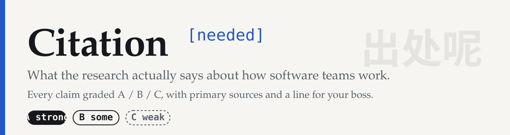
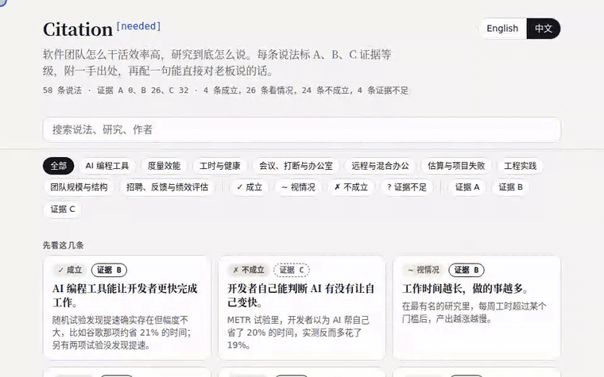

[English](README.md) · **简体中文**

 

**软件团队里的每一场争论，都附上出处和证据等级。**

加班能多干多少活？AI 编程工具到底快不快？远程办公效率低吗？团队扩了一倍，人均产出为什么降了？这里把这类争论逐条查了研究：**58 条说法，每条都标明结论、A/B/C 证据等级、一手出处，以及一句能直接对老板说的话。**

其中 4 条成立，26 条要看情况，24 条不成立，4 条证据不足。证据等级为 A 的有 0 条，B 26 条，C 32 条。按本仓库的分级标准，目前没有一条达到 A。各条目的研究设计、适用人群和局限见正文；没有 A 不代表没有随机试验。

> **怎么做出来的：** AI 协助起草，每个出处由持续集成自动查询，标为摘要核对的来源中，显式登记的引文片段由机器匹配，其他数字和结论推导没有自动核对。错了就[来反驳](#反驳一条结论)。详见[引用是怎么核对的](#引用是怎么核对的)。

## 先看这几条

| 说法 | 研究怎么说 | 结论 · 证据 |
|---|---|---|
| [AI 编程工具能让开发者更快完成工作。](chapters/01-ai.zh-CN.md#ai-faster) | 随机试验发现提速确实存在但幅度不大，比如谷歌那项约省 21% 的时间；另有两项试验没发现提速。 | ✓ 成立 · B |
| [开发者自己能判断 AI 有没有让自己变快。](chapters/01-ai.zh-CN.md#ai-self-estimate) | METR 试验里，开发者以为 AI 帮自己省了 20% 的时间，实测反而多花了 19%。 | ✗ 不成立 · C |
| [工作时间越长，做的事越多。](chapters/03-hours.zh-CN.md#hours-more-output) | 在最有名的研究里，每周工时超过某个门槛后，产出越涨越慢。 | ~ 视情况 · B |
| [每被打断一次，就要花 23 分钟才能恢复专注。](chapters/04-meetings.zh-CN.md#meetings-23-minutes) | 一项 24 人观察中，同日回到原工作的平均间隔是 25 分 26 秒，没有测量恢复专注时间。 | ✗ 不成立 · B |
| [开放式办公室能促进协作。](chapters/04-meetings.zh-CN.md#meetings-open-plan-collaboration) | 两家公司改成开放式办公后，面对面交流下降约 70%，电子沟通反而增加。 | ✗ 不成立 · B |
| [在家办公会降低工作效率。](chapters/05-remote.zh-CN.md#remote-wfh-productivity) | 两项随机试验发现居家有提升或没有损失；一项疫情期间的 IT 员工研究发现每小时产出下降 8% 至 19%。 | ~ 视情况 · B |
| [70% 的 IT 项目都会失败。](chapters/06-estimation.zh-CN.md#estimation-chaos-failure-rate) | “70%”把任何偏离最初预估的项目都算作失败，两篇同行评审的批评认为这些数字有误导性。 | ✗ 不成立 · B |
| [存在 10 倍程序员：有些开发者的效能是同行的十倍。](chapters/07-practices.zh-CN.md#practices-10x-programmer) | “10 倍程序员”背后的 28:1 来自 1960 年代的实验室研究，后来的重新分析称它不准确且有误导性。 | ? 证据不足 · C |
| [代码评审主要是用来发现缺陷的。](chapters/07-practices.zh-CN.md#practices-code-review-bugs) | 在微软，只有 14% 的评审意见与缺陷有关；其他团队的研究发现，约 75% 的发现关乎可维护性。 | ✗ 不成立 · B |
| [给已经延期的项目加人，会让它更晚交付。](chapters/08-teams.zh-CN.md#teams-brooks-law) | 布鲁克斯自己说这是过度简化。在最有名的模拟里，晚加人总会推高成本，但不一定拖延交付。 | ~ 视情况 · C |
| [凭感觉聊一聊的面试，是招人的好办法。](chapters/09-people.zh-CN.md#people-gut-interview) | 2022 年的一项荟萃分析显示，预测工作表现时，结构化面试约 .42，非结构化面试只有 .19。 | ✗ 不成立 · B |

## 怎么用

- **网页阅读器**（可搜索，可勾选几条生成“给老板的一页纸”）: https://mbappewu.github.io/citation-needed/
- **离线版**：单文件 HTML 和 PDF 在 [Releases](https://github.com/MbappeWU/citation-needed/releases/latest)
- **对 AI 助手提问**：`npx skills add MbappeWU/citation-needed` （Claude Code、Codex、Cursor 等；回答时会带上证据等级和出处）

## 目录

### [AI 编程工具](chapters/01-ai.zh-CN.md)

它们让团队更快、更稳、更好吗？随机对照试验和现场数据怎么说。

| 说法 | 结论 | 证据 |
|---|---|---|
| [AI 工具不会损害代码质量。](chapters/01-ai.zh-CN.md#ai-code-quality) | ✗ 不成立 | C |
| [AI 生成的代码和人写的代码一样安全。](chapters/01-ai.zh-CN.md#ai-code-security) | ✗ 不成立 | C |
| [采用 AI 能提升软件交付表现。](chapters/01-ai.zh-CN.md#ai-delivery) | ~ 视情况 | C |
| [AI 工具能让经验丰富的开发者更快。](chapters/01-ai.zh-CN.md#ai-experienced-faster) | ~ 视情况 | C |
| [AI 编程工具能让开发者更快完成工作。](chapters/01-ai.zh-CN.md#ai-faster) | ✓ 成立 | B |
| [AI 对初级开发者的帮助比对资深开发者更大。](chapters/01-ai.zh-CN.md#ai-juniors-more) | ~ 视情况 | C |
| [使用 AI 不会影响开发者的学习效果。](chapters/01-ai.zh-CN.md#ai-learning) | ✗ 不成立 | B |
| [那些 AI 研究已经过时了，因为今天的工具强多了。](chapters/01-ai.zh-CN.md#ai-old-studies) | ~ 视情况 | C |
| [开发者自己能判断 AI 有没有让自己变快。](chapters/01-ai.zh-CN.md#ai-self-estimate) | ✗ 不成立 | C |

### [度量效能](chapters/02-measure.zh-CN.md)

什么该数，什么会误导，以及为什么团队越大人均产出越低。

| 说法 | 结论 | 证据 |
|---|---|---|
| [每位开发者的提交数或 PR 数，能看出谁的表现最好。](chapters/02-measure.zh-CN.md#measure-commits-per-dev) | ✗ 不成立 | C |
| [DORA 的四个关键指标能预测团队的表现。](chapters/02-measure.zh-CN.md#measure-dora-predict) | ~ 视情况 | C |
| [代码行数是衡量开发者效能的合理指标。](chapters/02-measure.zh-CN.md#measure-lines-of-code) | ✗ 不成立 | C |
| [发布次数、上线功能数或完成的工单数，可以衡量团队的产出。](chapters/02-measure.zh-CN.md#measure-releases-output) | ✗ 不成立 | C |
| [开发者满意度是效能的领先指标。](chapters/02-measure.zh-CN.md#measure-satisfaction-leading) | ~ 视情况 | C |
| [一个指标就能反映开发者的效能。](chapters/02-measure.zh-CN.md#measure-single-metric) | ✗ 不成立 | C |
| [用故事点算出的速率，可以用来比较不同团队。](chapters/02-measure.zh-CN.md#measure-velocity-compare) | ✗ 不成立 | C |

### [工时与健康](chapters/03-hours.zh-CN.md)

加班、单位工时产出，以及健康代价。

| 说法 | 结论 | 证据 |
|---|---|---|
| [每周只上四天，事情就会做得更少。](chapters/03-hours.zh-CN.md#hours-four-day-week) | ? 证据不足 | C |
| [长时间工作只是一种生活方式，对健康没有实质代价。](chapters/03-hours.zh-CN.md#hours-health-cost) | ✗ 不成立 | B |
| [工作时间越长，做的事越多。](chapters/03-hours.zh-CN.md#hours-more-output) | ~ 视情况 | B |

### [会议、打断与办公室](chapters/04-meetings.zh-CN.md)

关于专注时间和开放式办公室的各种说法，逐条核对。

| 说法 | 结论 | 证据 |
|---|---|---|
| [每被打断一次，就要花 23 分钟才能恢复专注。](chapters/04-meetings.zh-CN.md#meetings-23-minutes) | ✗ 不成立 | B |
| [连续开会没什么害处。](chapters/04-meetings.zh-CN.md#meetings-back-to-back) | ? 证据不足 | C |
| [每日站会能改善团队协调。](chapters/04-meetings.zh-CN.md#meetings-daily-standups) | ~ 视情况 | C |
| [开发者需要长时间不被打断的整块时间才能高效工作。](chapters/04-meetings.zh-CN.md#meetings-focus-blocks) | ~ 视情况 | C |
| [设立无会议日能提高生产力。](chapters/04-meetings.zh-CN.md#meetings-no-meeting-days) | ? 证据不足 | C |
| [开放式办公室能促进协作。](chapters/04-meetings.zh-CN.md#meetings-open-plan-collaboration) | ✗ 不成立 | B |

### [远程与混合办公](chapters/05-remote.zh-CN.md)

随机实验和现场数据，包括一家大型中国公司的实验。

| 说法 | 结论 | 证据 |
|---|---|---|
| [远程办公会损害团队协作。](chapters/05-remote.zh-CN.md#remote-collaboration) | ~ 视情况 | B |
| [远程办公的开发者产出更少。](chapters/05-remote.zh-CN.md#remote-developers-output) | ~ 视情况 | C |
| [混合办公会拖累绩效和晋升。](chapters/05-remote.zh-CN.md#remote-hybrid-performance) | ✗ 不成立 | B |
| [初级工程师远程办公学不到东西。](chapters/05-remote.zh-CN.md#remote-juniors-learning) | ~ 视情况 | B |
| [创意工作用视频会议和当面开会效果一样好。](chapters/05-remote.zh-CN.md#remote-video-creativity) | ✗ 不成立 | B |
| [在家办公会降低工作效率。](chapters/05-remote.zh-CN.md#remote-wfh-productivity) | ~ 视情况 | B |

### [估算与项目失败](chapters/06-estimation.zh-CN.md)

计划为什么总会延期，以及哪些“失败率”数字不该再引用。

| 说法 | 结论 | 证据 |
|---|---|---|
| [有经验的估算者不会被锚定效应影响。](chapters/06-estimation.zh-CN.md#estimation-anchoring-experts) | ✗ 不成立 | B |
| [只要计划做得足够细，软件估算就会准。](chapters/06-estimation.zh-CN.md#estimation-careful-planning) | ✗ 不成立 | C |
| [70% 的 IT 项目都会失败。](chapters/06-estimation.zh-CN.md#estimation-chaos-failure-rate) | ✗ 不成立 | B |
| [专家凭经验估算，不如正式的估算模型准确。](chapters/06-estimation.zh-CN.md#estimation-experts-vs-models) | ✗ 不成立 | C |
| [IT 项目的超支幅度是可预测的，留一个固定缓冲就够了。](chapters/06-estimation.zh-CN.md#estimation-overrun-margin) | ✗ 不成立 | C |
| [工期压得紧，团队的效率就更高。](chapters/06-estimation.zh-CN.md#estimation-tight-deadlines) | ~ 视情况 | B |

### [工程实践](chapters/07-practices.zh-CN.md)

结对编程、TDD、代码评审、类型系统、技术债。

| 说法 | 结论 | 证据 |
|---|---|---|
| [存在 10 倍程序员：有些开发者的效能是同行的十倍。](chapters/07-practices.zh-CN.md#practices-10x-programmer) | ? 证据不足 | C |
| [敏捷项目比瀑布项目更容易成功。](chapters/07-practices.zh-CN.md#practices-agile-succeeds) | ~ 视情况 | C |
| [代码评审主要是用来发现缺陷的。](chapters/07-practices.zh-CN.md#practices-code-review-bugs) | ✗ 不成立 | B |
| [结对编程能提高代码质量。](chapters/07-practices.zh-CN.md#practices-pair-programming) | ~ 视情况 | B |
| [发布得越快，线上事故就越多。](chapters/07-practices.zh-CN.md#practices-speed-incidents) | ~ 视情况 | C |
| [静态类型能防止缺陷。](chapters/07-practices.zh-CN.md#practices-static-typing-bugs) | ~ 视情况 | B |
| [测试驱动开发（TDD）能减少缺陷。](chapters/07-practices.zh-CN.md#practices-tdd-defects) | ~ 视情况 | B |
| [技术债会拖慢团队。](chapters/07-practices.zh-CN.md#practices-tech-debt-slows) | ✓ 成立 | B |

### [团队规模与结构](chapters/08-teams.zh-CN.md)

布鲁克斯定律、康威定律、心理安全感。

| 说法 | 结论 | 证据 |
|---|---|---|
| [最佳团队规模是 5 到 9 人。](chapters/08-teams.zh-CN.md#teams-best-size-five-to-nine) | ~ 视情况 | C |
| [给已经延期的项目加人，会让它更晚交付。](chapters/08-teams.zh-CN.md#teams-brooks-law) | ~ 视情况 | C |
| [系统架构最终会照搬组织架构（康威定律）。](chapters/08-teams.zh-CN.md#teams-conway-law) | ✓ 成立 | B |
| [团队人数翻倍，产出也翻倍。](chapters/08-teams.zh-CN.md#teams-double-team-double-output) | ✗ 不成立 | B |
| [心理安全感能预测团队的绩效。](chapters/08-teams.zh-CN.md#teams-psychological-safety) | ✓ 成立 | B |
| [坐在一起办公的团队，交付更快。](chapters/08-teams.zh-CN.md#teams-sit-together-ship-faster) | ~ 视情况 | C |

### [招聘、反馈与绩效评估](chapters/09-people.zh-CN.md)

什么能预测工作表现，评分到底在测什么。

| 说法 | 结论 | 证据 |
|---|---|---|
| [奖金能激励人在复杂任务上做得更好。](chapters/09-people.zh-CN.md#people-bonus-complex-tasks) | ~ 视情况 | C |
| [给反馈总能提高工作表现。](chapters/09-people.zh-CN.md#people-feedback-improves) | ✗ 不成立 | B |
| [强制排名能提升团队绩效。](chapters/09-people.zh-CN.md#people-forced-ranking) | ✗ 不成立 | C |
| [凭感觉聊一聊的面试，是招人的好办法。](chapters/09-people.zh-CN.md#people-gut-interview) | ✗ 不成立 | B |
| [经理的绩效评分反映了员工的真实表现。](chapters/09-people.zh-CN.md#people-manager-ratings) | ~ 视情况 | B |
| [白板编程面试能看出一个人代码写得好不好。](chapters/09-people.zh-CN.md#people-whiteboard-coding) | ~ 视情况 | C |
| [工作年限越长，工作表现越好。](chapters/09-people.zh-CN.md#people-years-experience) | ~ 视情况 | B |

## 证据等级怎么定

等级衡量的是**结论背后的证据有多强**，不是这个说法听起来对不对。

- **A 证据充分**：至少两项独立的高质量研究结论一致（随机对照试验、预注册或被复现的研究、对对照研究的荟萃分析），或一项规模大、做得好的随机对照试验，且人群与我们相近。
- **B 证据一般**：一项有局限的好实验或自然实验，或一致的大规模观察性证据，或对观察性研究的荟萃分析，或对历史数据的严谨再分析。
- **C 证据薄弱**：专家意见、案例研究、模拟、厂商报告、小样本或单项研究，或对度量方法的批评。我们会直接说出来。C 级也有用：它告诉你的老板，这件事并没有定论。

## 引用是怎么核对的

本仓库共 125 个来源，每个都在持续集成里自动查询：**50 个**（✓✓）核对了标题、作者、年份，以及显式登记的引文片段是否出现在摘要里（共 81 处引文，分布在 39 条说法里）；**44 个**（✓）核对了元数据；**31 个**（↗）是书、报告或网页，只核对链接能否打开。每周跑一次，在数据或验证脚本变更时也会跑，并可手动触发。内容不匹配会报错；网络不可达记为警告，不会自动使工作流失败，需阅读检查报告。

**没有覆盖的部分：** 持续集成只能读摘要，读不了全文。机器只匹配登记的摘要引文片段，不验证数字的语境、因果解释或结论分级；未登记的数字和出自论文正文、报告或书的数字没有自动核对，有些条目依据的是二手转述，会在“局限”里写明。本仓库的初稿由 AI 协助起草，还没有经过专家逐行审阅。所以每条都写了“什么证据会让我改口”，也欢迎你来反驳：开一个 issue，附上论文和页码，错了我们就改，并署名感谢。

## 反驳一条结论

有更好的证据、发现了错误，或者漏掉了一项重要研究？开一个 [Challenge issue](https://github.com/MbappeWU/citation-needed/issues/new?template=challenge.yml)。证据等级会公开升降，并署名感谢提供证据的人。想新增一条说法，用 [Propose](https://github.com/MbappeWU/citation-needed/issues/new?template=propose.yml)。贡献规则见 [CONTRIBUTING.md](CONTRIBUTING.md)。

## 许可证

文字和数据采用 [CC BY 4.0](https://creativecommons.org/licenses/by/4.0/deed.zh-hans)：可以转载、改编，请保留署名并链回本仓库。脚本采用 MIT 许可证。
